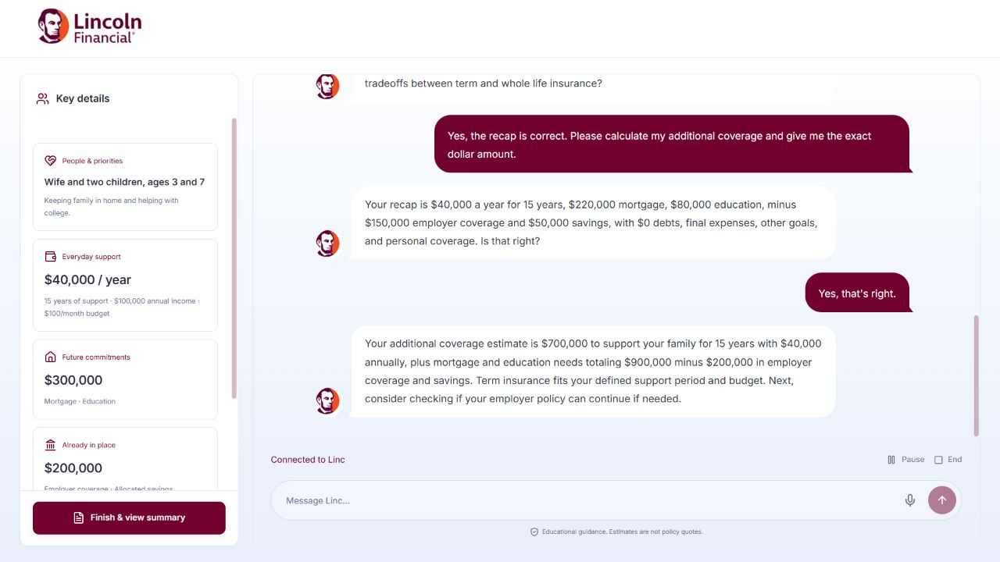
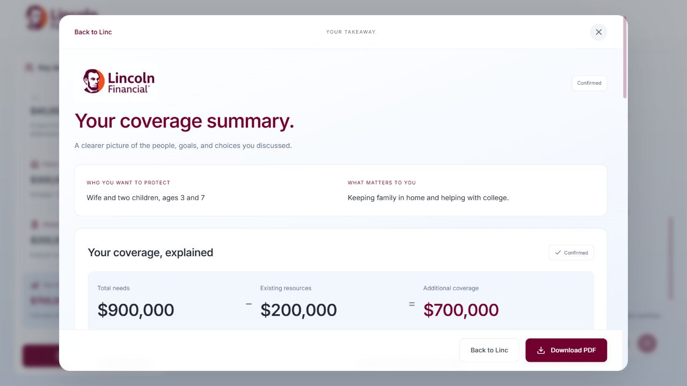
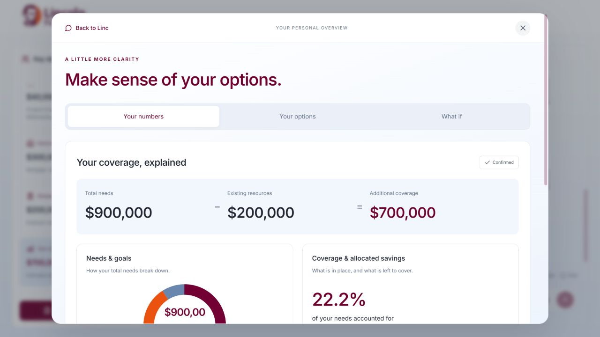
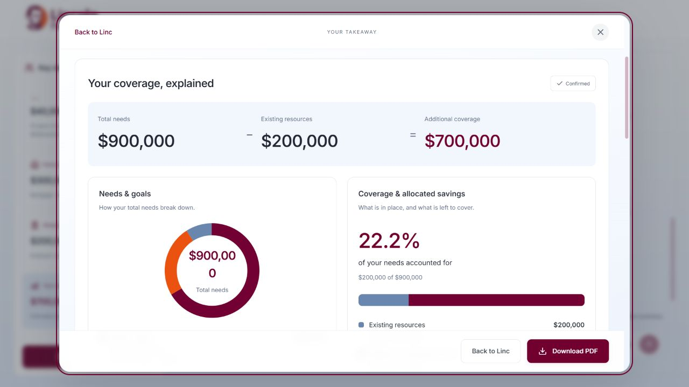
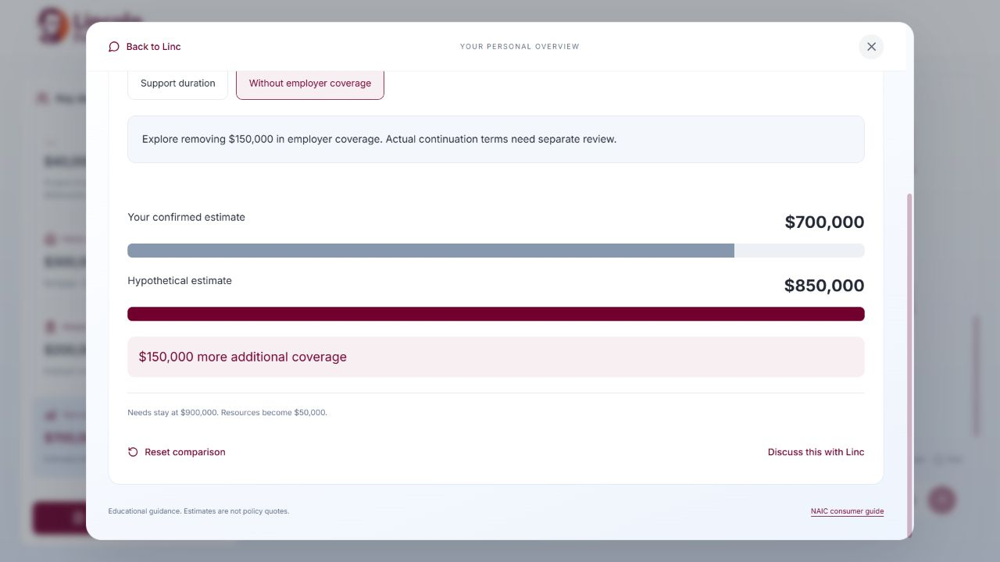
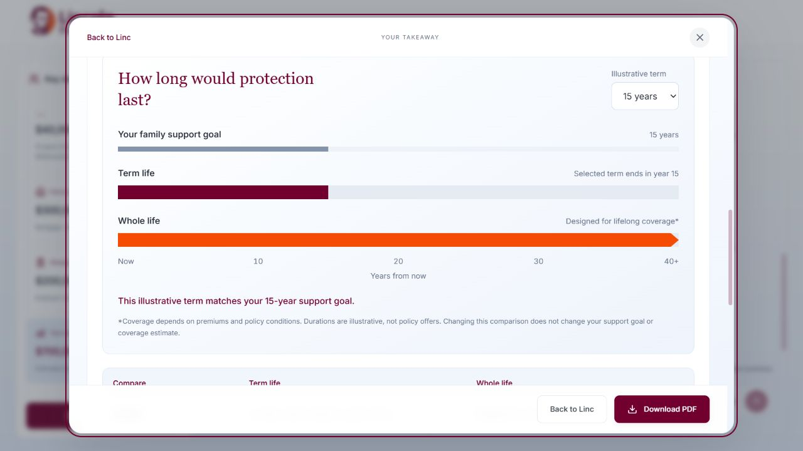

# Linc · CodeLinc 11

Understand life insurance through a conversation. Linc captures your details, explains the coverage math, and creates a downloadable planning summary.

**[Try the live app](https://main.d35dfcm91lxufk.amplifyapp.com)**

## What it does

- **Talk or type:** English microphone dictation with live transcription and automatic sending. Linc replies in text.
- **Capture key details:** Family, support needs, goals, and existing coverage update as you chat.
- **Explore alternatives:** Compare support periods or remove employer coverage without changing your confirmed details.
- **Leave with a report:** See a needs breakdown, coverage gap, term-versus-whole-life timeline, and downloadable PDF.

## Screenshots

Captured from the live app using sample details. Click an image to enlarge it.

| Key details & exploration | Final report |
| --- | --- |
| **Captured details**<br>[](docs/screenshots/01-key-details.png) | **Confirmed summary & PDF**<br>[](docs/screenshots/04-final-report.png) |
| **Coverage math**<br>[](docs/screenshots/02-key-details-numbers.png) | **Needs & coverage charts**<br>[](docs/screenshots/05-report-charts.png) |
| **What-if comparison**<br>[](docs/screenshots/03-what-if.png) | **Term versus whole life**<br>[](docs/screenshots/06-term-whole-life.png) |

## Run locally

Requires Node.js 22.22+ and npm.

```sh
npm ci
cp .env.example .env.local
```

For live chat and dictation, set `ELEVENLABS_API_KEY`, `ELEVENLABS_AGENT_ID`, and `APP_ORIGIN` in `.env.local`. Keep the key server-side; this file is excluded from Git.

Configure a private, text-only ElevenLabs agent using the [agent settings](docs/elevenlabs-agent.json), [system prompt](docs/agent-prompt.md), and [client tools](docs/client-tools.json). Allow your development origin.

```sh
npm run dev
```

Open [localhost:3000](http://127.0.0.1:3000). Without provider credentials, a guided fallback is available. Refreshing clears the app's in-memory conversation and profile.

## How the estimate works

```text
Needs = annual family support × years + debts + one-time goals
Resources = employer coverage + personal coverage + allocated savings
Additional coverage = max(0, needs − resources)
```

A final estimate requires confirmed details. Unknown amounts are not counted as zero. What-if scenarios keep the original estimate unchanged and do not replace it in the report.

Educational estimates only, not policy quotes. Inflation, investment returns, taxes, and eligibility are not modeled. This project is not an official Lincoln Financial service.

## Stack & deployment

Next.js · React · TypeScript · ElevenLabs Agents & Scribe · AWS Amplify · Secrets Manager

Pushes to `main` deploy automatically. The production API key stays in Secrets Manager. See the [AWS deployment guide](docs/aws-deployment.md) and [demo checklist](docs/demo-checklist.md).
